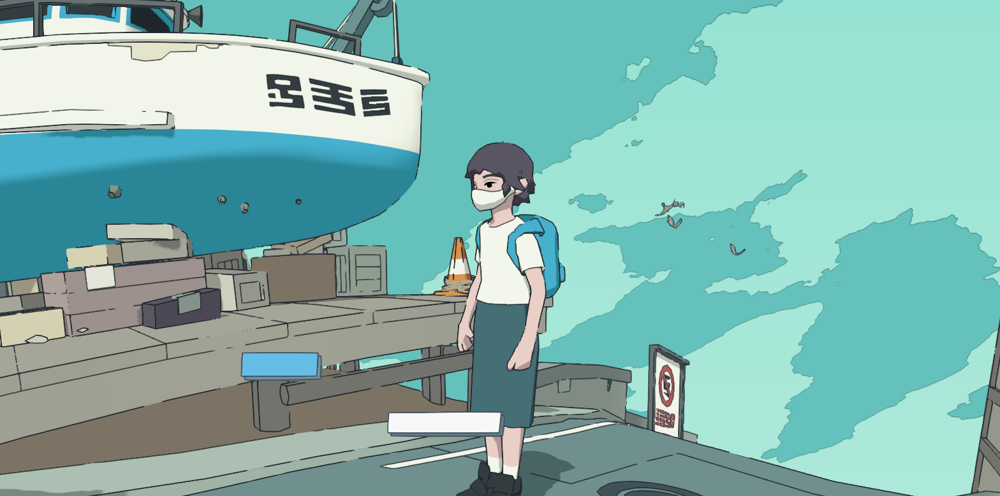

# Références Visuelles

Bibliothèque de références pour le direction artistique de *Día de Muertos*.

---

## Style : Cel-Shading / Dessin Animé

### `cel-shading-ref-01.png`

**Source :** Screenshot partagé en session (2026-06-20)  
**Ce qu'on retient :**
- Couleurs plates par zones, palette limitée (3-4 tons par objet)
- Contours noirs nets autour des silhouettes et arêtes
- Ombres en "bandes" (stepped), pas de gradient lisse
- Ciel : aplat bleu-turquoise, pas de texture
- Style général : jeu narratif coréen (tonalité proche de *Florence*, *A Short Hike*)

**Implémentation R3F :**
- `MeshToonMaterial` pour les matériaux
- `@react-three/postprocessing` + `Outline` pour contours noirs
- `GradientMap` custom (2-3 niveaux) pour contrôler les bandes d'ombre

**Lien vers notes implémentation :** voir conversation 2026-06-20 — "Ce serait compliqué ?"

---

## Cible aspirationnelle : rendu peint / Ghibli

### `rooms/cuisine/cuisine-entree-02.png` + `cuisine-coin-pierres-02.png`

**Source :** générations ChatGPT (GPT-4o image), 2026-07-10
**Statut :** cible de rendu qu'on aimerait atteindre (décision Sylvain 2026-07-10) — pas une promesse technique, un horizon.

**Ce qu'on retient :**
- Matière picturale : touches de pinceau, murs granuleux, rien de plat
- Lumière : halo d'ampoule chaud contre nuit bleue dans les vitres, ombres colorées (jamais noires)
- Profondeur : les fonds de pièce fondent dans la pénombre chaude

**Chemin technique (par paliers, du moins cher au plus cher) :**
1. ✅ Fog chaud + bloom + vignette (`TOON_RICHE` dans App.tsx) — posé, tuning à faire
2. Gradient toon 4-5 bandes + ombres teintées (couleur d'ombre chaude, pas grise)
3. Textures peintes générées (image AI → texture tileable murs/sol) — remplace les aplats
4. Post-processing peintre (grain, léger displacement des contours) — à expérimenter avec prudence, gadget vite atteint

Le palier 3 est celui qui rapproche vraiment du rendu peint. Il reste compatible pipeline 0 € (générer des textures = même outil que les concepts).

## À venir

Ajouter ici les références pour :
- [ ] Palette couleurs Día de Muertos (orange/violet/noir/dorés)
- [ ] Références lumière de bougie / marigold
- [ ] Style UI / typographie
- [ ] Références audio (ambient, spatial)
